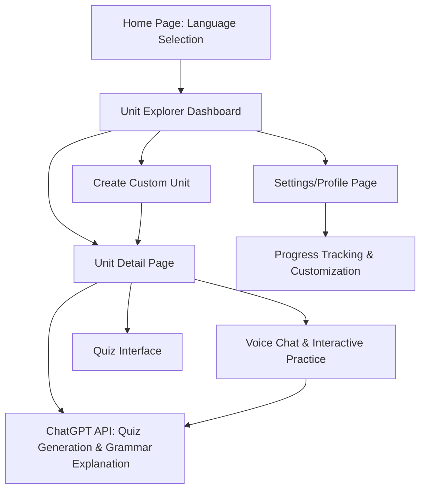

# Project Documentation

This document provides an integrated overview of the key project artifacts for the interactive language learning web application. It includes project rules, requirements, app flow, technology stack details, frontend and backend structure guidelines, flowchart, security guidelines, and a high-level implementation plan. All sections follow secure-by-design principles, incorporating best practices for authentication, data protection, input sanitization, and scalable architecture.

---

## 1. cursor_project_rules

- **Coding Standards:**
  - Use TypeScript and adhere to strict typing for better maintainability.
  - Follow ESLint and Prettier configurations to ensure code consistency and clarity.
  - Naming conventions: use clear, descriptive naming for variables, functions, and components.

- **Error Handling:**
  - Implement robust error handling with try/catch blocks. Avoid exposing sensitive stack traces in production.
  - Use centralized error logging and monitoring.

- **Dependency Management:**
  - Manage dependencies with a lockfile (e.g., package-lock.json).
  - Regularly scan use SCA tools for known vulnerabilities.

- **Code Reviews & Commits:**
  - Peer reviews are mandatory for all pull requests.
  - Ensure consistent commit messages and documentation with every change.

- **Security & Privacy:**
  - Secure default configurations must be enforced. 
  - API keys and secrets should be stored securely and not hard-coded.

---

## 2. project_requirements_document

- **Overview:**
  - Develop an interactive web application for language learners focused on dynamic content generation and progress tracking.

- **Key Features:**
  - **Language Selection:** Landing page with multiple language options (initially English).
  - **Unit Explorer and Detail:** Browse pre-made (20 basic units) and custom units. Detail view to include vocabulary, grammar, sentence practice, and voice chat.
  - **Interactive Quizzes:** Auto-generated quizzes with mnemonics and etymology provided via ChatGPT API.
  - **Voice Chat:** A real-time conversation practice widget, using ChatGPT’s voice mode without initial voice recognition requirements.
  - **User Progress Tracking:** Track unit completion percentage and progress.

- **User Roles:**
  - Single role: learner. Role-based access control (RBAC) will be enforced on backend endpoints.

- **Non-Functional Requirements:**
  - Scalability
  - Reliability
  - Security and data privacy aligned with GDPR/CCPA essentials

- **Future Enhancements:**
  - AI-based pronunciation feedback
  - Eventual monetization and payment integrations

---

## 3. app_flow_document

### Application Flow Overview:

1. **Home Page / Language Selection:**
   - User chooses a language (Initially English).
   - Redirects to Unit Explorer.

2. **Unit Explorer Dashboard:**
   - Display list of pre-made and user-created units.
   - Options to create a new custom unit.

3. **Unit Detail Page:**
   - Show vocabulary, grammar, sentence practice blocks.
   - **Voice Chat Section:**
     - Interactive voice chat powered by ChatGPT API.

4. **Quiz Interface:**
   - Launch quiz session displaying questions in JSON format with hints such as mnemonics and etymology.

5. **Settings/Profile Page:**
   - Display progress tracking (completion percentages, statistics).
   - Allow customization of learning preferences.

6. **API Requests:**
   - All dynamic content (quizzes, grammar discussions, voice chat context) retrieved via ChatGPT or GPT 4o API.

---

## 4. tech_stack_document

### Frontend:
- **Framework:** Next.js 14 (App Router)
- **Language:** TypeScript (enforces type safety and better security through predictable code)
- **Styling:** Tailwind CSS
- **UI Library:** shadcn UI

### Backend & Storage:
- **Platform:** Supabase
  - **Database:** Postgres (structured schema for language data, user progress, custom units)
  - **Authentication:** Managed by Supabase with secure session management and token validation
  - **Storage:** For media files and additional assets

### AI Integration:
- **APIs:**
  - ChatGPT API for dynamic content generation (quizzes, grammar explanations)
  - GPT 4o for advanced content generation scenarios

### Tools:
- **IDE:** Cursor (AI-powered IDE for enhanced code quality and faster development)

---

## 5. frontend_guidelines_document

- **Component Structure:**
  - Use functional components with hooks.
  - Break UI into reusable components (e.g., LanguageSelector, UnitCard, QuizComponent, VoiceChatWidget).

- **User Input Handling:**
  - Sanitize all user inputs and escape outputs to prevent XSS.
  - Validate all form submissions on client side and server side.

- **State Management:**
  - Use React context or a state management library if needed.
  - Ensure state updates are immutable and predictable.

- **Styling & Responsiveness:**
  - Tailwind CSS for responsive UI.
  - Follow design best practices ensuring UI elements are accessible and mobile-friendly.

- **API Calls:**
  - Use fetch or a library like axios with proper error handling.
  - Securely manage and abstract API keys using environment variables.

---

## 6. backend_structure_document

- **Architecture:**
  - Use Supabase’s RESTful endpoints along with serverless functions if necessary.
  - Define clear role-based access controls: only learners have access, with strict authorization for all endpoints.

- **Database Schema:**
  - **Users Table:** User details, secure password storage (bcrypt/Argon2), progress tracking fields.
  - **Units Table:** Contains pre-made and user-defined learning units. Store unit metadata and content structure (vocabulary, grammar, etc.).
  - **Progress Table:** Tracks user progress per unit, timestamps, and completion percentages.
  - **Activity Logs:** For auditing purposes and troubleshooting (ensure sensitive info is redacted).

- **API Integration with ChatGPT/GPT 4o:**
  - Secure token management (store secrets in environment variables, use Supabase’s secret management features).
  - Implement rate limiting to handle API requests gracefully and avoid abuse.

- **Security:**
  - Encrypted connections (TLS 1.2+).
  - Validate inputs on every endpoint to prevent SQL injection and other attacks.

---

## 7. app_flowchart

---

## 8. security_guideline_document

- **Authentication & Access Control:**
  - Use Supabase for robust authentication. Enforce strong password policies (Argon2 or bcrypt hashing) and secure session management.
  - Apply RBAC for each API endpoint with strict roles (learner only).
  
- **Input Validation & Output Encoding:**
  - Validate and sanitize all user-supplied inputs on both client and server sides.
  - Utilize parameterized queries and ORM capabilities to protect against injection attacks.
  
- **Data Encryption and Protection:**
  - Secure sensitive data at rest and in transit (TLS 1.2+ for API calls, database connections, HTTPS for frontend).
  - Use AES-256 encryption for critical data storage.

- **API & Service Security:**
  - Enforce HTTPS for all API communications with ChatGPT and GPT 4o, including proper handling of rate limits and error responses.
  - Configure CORS policies strictly to allow only trusted origins.

- **Miscellaneous Security Practices:**
  - Implement secure defaults in configurations.
  - Use security headers (CSP, Strict-Transport-Security, X-Content-Type-Options, X-Frame-Options, and Referrer Policy).
  - Regular security reviews and vulnerability scans on all dependencies.

---

## 9. implementation_plan

### Phase 1: Project Setup and Initial Configuration

- **Environment Configuration:**
  - Set up a Next.js 14 project with TypeScript, Tailwind CSS, and shadcn UI.
  - Configure ESLint, Prettier, and commit hooks.
  - Integrate Supabase for database and authentication management.

- **Security Implementations:**
  - Configure secure defaults (environment variables for API keys, secure session management).
  - Establish secure code review processes.

### Phase 2: Core Features Development

- **Frontend Development:**
  - Develop home page with language selection.
  - Build Unit Explorer and Detail pages with dynamic content placeholders.
  - Implement Quiz Interface using ChatGPT API to fetch questions.
  - Develop Voice Chat UI component; integrate with ChatGPT API for context-based conversation.

- **Backend Development:**
  - Define the database schema in Supabase for users, units, and progress tracking.
  - Implement RESTful endpoints and serverless functions if needed, ensuring proper authorization checks.
  - Integrate ChatGPT API interactions; include error handling and rate-limiting logic.

### Phase 3: Integration & Testing

- **Integration Testing:**
  - Test complete user flows from registration and language selection to unit completion and progress tracking.
  - Validate that dynamic content generation works correctly with the ChatGPT API and that errors are handled securely.

- **Security Auditing:**
  - Perform penetration tests focusing on input validation, API token management, and access control.
  - Audit code for any potential dependency vulnerabilities.

### Phase 4: Deployment & Monitoring

- **Deployment:**
  - Deploy on a secure hosting environment ensuring TLS encryption and hardened server configurations.
  - Use CI/CD pipelines integrating security checks (linting, dependency vulnerability scans).

- **Monitoring & Maintenance:**
  - Implement centralized logging and monitoring.
  - Set up alerts for unusual patterns (rate limits, error spikes).
  - Schedule regular audits and update dependencies to patch security vulnerabilities.

---

Each phase is designed with secure-by-design practices, ensuring the application remains resilient, secure, and scalable throughout its lifecycle.
